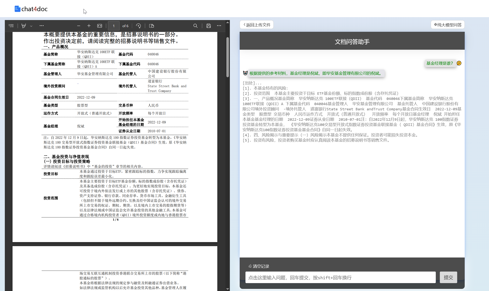

# chat4doc
RAG的最小实现

## Quick start
- 配置config文件, 若修改需同步修改`client_py/static/js/script.js`中相关配置
- 执行`sh start.sh`开启服务
- 访问[http://localhost:8083/chat4doc](http://localhost:8083/chat4doc)，并上传pdf进行解析

## 文件说明
- `client_py`: 前端webui
- `server`: 后端（含llm和召回模块）

## Todo
- ~~文章加载完先调用大模型简单介绍pdf的情况~~
- 流式回复
- 出处的地方可以点击，并在pdf上跳转到指定的页面并高亮
- pdf展示这块使用html的格式
- 提升召回模块的准确性
- 适配更多的大模型

## reference
- [chatpdf](https://github.com/shibing624/ChatPDF)
- [ChatDocs](https://github.com/marella/chatdocs)
- [DocsGPT](https://github.com/arc53/DocsGPT)
- [ChatLLM](https://github.com/yuanjie-ai/ChatLLM)
- [pdfGPT](https://github.com/bhaskatripathi/pdfGPT)
- [gpt_academic](https://github.com/binary-husky/gpt_academic)
- [ChatPaper](https://github.com/kaixindelele/ChatPaper)
- [chatdoc](https://github.com/daodao97/chatdoc)